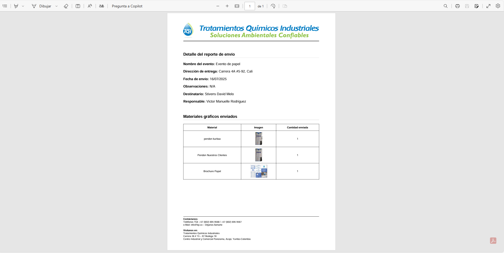
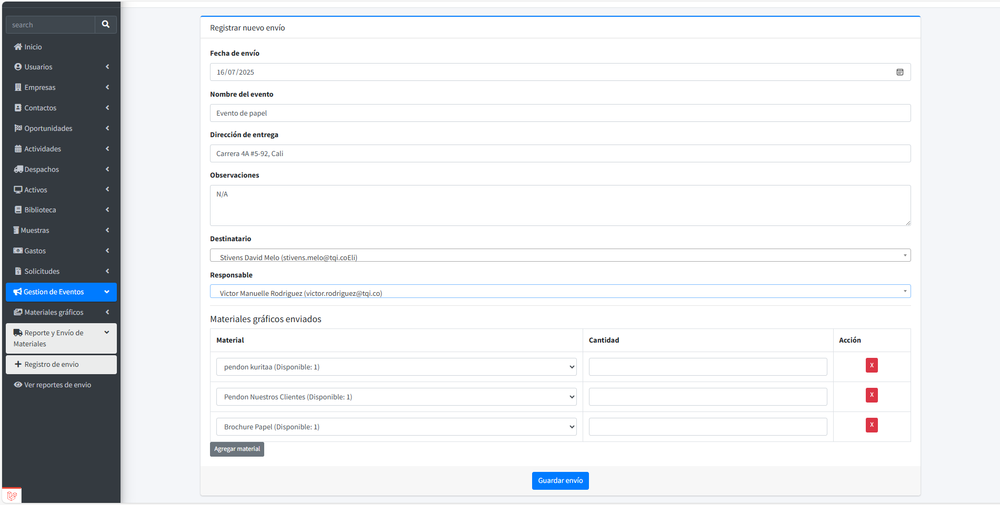
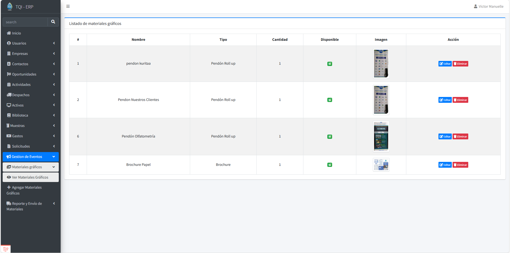
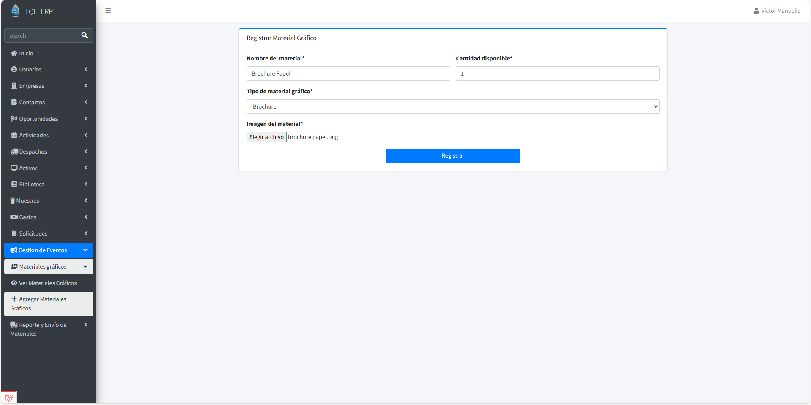

# Plataforma de Gestión de envios de Materiales

Sistema modular integrado al CRM de la empresa para la **gestión eficiente de envíos de materiales en eventos empresariales**.  
Resuelve la falta de trazabilidad y control en el envío de materiales a ferias, exposiciones y otros eventos, permitiendo un registro preciso y seguimiento en tiempo real.

---

## Funcionalidades

- **Inventario centralizado de materiales**: mantiene un registro actualizado de todos los materiales de la empresa , con control de cantidades disponibles.  
- **Gestión de envíos a eventos**: permite que los encargados registren los envíos de materiales a ferias, exposiciones y eventos, asegurando trazabilidad y control.  
- **Registro y seguimiento de reportes**: cada envío se documenta mediante un formulario simple, y los administradores pueden visualizar todos los reportes en la aplicación.  
- **Generación y descarga de reportes en PDF**: los reportes pueden ser exportados en PDF, facilitando la documentación y distribución de información.  
- **Edición de reportes**: los encargados pueden actualizar reportes en caso de errores o cambios, manteniendo la información siempre correcta y confiable.  
- **Control de integridad de datos**: validación de campos y control de cantidades, garantizando la consistencia del inventario y de los reportes.  

---

## Tecnologías

- Laravel (Backend)  
- Blade Templates (Frontend)  
- JavaScript (interactividad y manipulación dinámica de formularios)  
- Bootstrap (diseño responsivo y estilizado)
- MySQL (Base de datos)
- MySQL WorkBench

---

## Capturas de pantalla

### 1. Listado de envíos

### 2. PDF del reporte de envío

### 3. Registrar reporte de envío

### 4. Listado de materiales gráficos

### 5. Registrar materiales gráficos

---
## Autor

**Victor Manuelle Rodriguez Mosquera**  
Correo: rodriguezvictormanuelle@gmail.com
